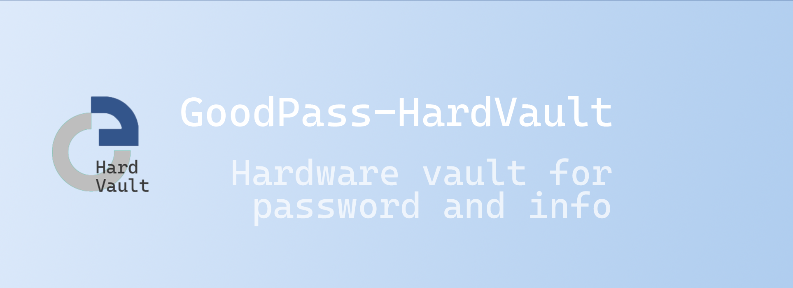

# GoodPass-HardVault

    

> Developed by GeorgeDong32 
>
> <Copyright (c) GeorgeDong32(Github). All rights reserved.>

<h4>
This repo is set up to help developer develop GoodPass and stores developing codes. 
The codes there may have serious problems, so don't use them for other development! 
</h4>

Go to [GoodPass](https://github.com/GeorgeDong32/GoodPass) for more project infomation

Go to [GoodPass | GoodPass HardVault](https://georgedong32.github.io/GoodPass/GoodPass-HardVault) for more information.

## License

[The GoodPass License](https://github.com/GeorgeDong32/GoodPass/blob/main/LICENSE)

    

